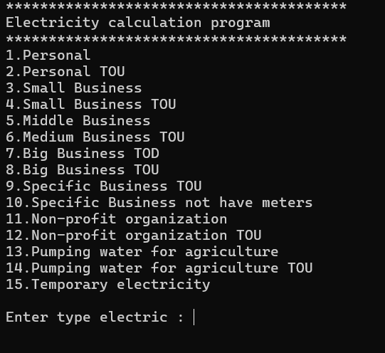
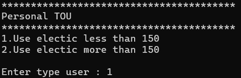
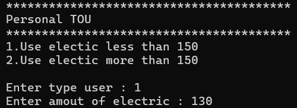
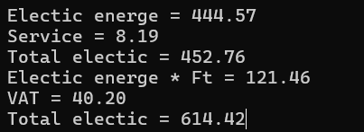

# Mini-Project-Calculate-Electricity

## หน้า Menu
เป็นหน้าที่มี 15 ตัวเลือกในการคิดค่าไฟซึ่งในเเต่ละในตัวเลือกจะมีการคำนวณที่ไม่เหมือนกัน

## หน้าให้เลือกว่าคุณใช้ไฟมากหรือน้อยกว่า 150 หน่วย
หน้านี้จะเป็นการให้เลือกว่าไฟที่คุณใช้มากกว่าหรือน้อยกว่า 150 หน่วย น้อยกว่ากด 1 มากกว่ากด 2

## หน้าให้ใส่ว่าเราใช้ไฟไปกี่หน่วย
หน้านี้จะเป็นการใส่เข้าไปว่าเราเนี้ยใช้ไฟไปกี่หน่วยเพื่อให้มันคำนวณเเละเเสดงผลลัพธ์ออกมา

## หน้าผลลัพธ์ที่ได้
หน้านี้จะเป็นการเเสดงผลลัพธ์ออกมา

